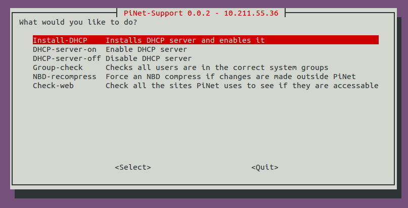

# PiNet-Support


Experimental support tool for diagnosing issues with PiNet setups.   
This tool should only be used if directed to do so by PiNet support team or if needing to check web access.   

## Installing
To install, simply download the main script using wget.   
1. Open a terminal   
2. Enter ```wget "https://raw.githubusercontent.com/PiNet/PiNet-Support/master/pinet-support"```
3. To run it, use ```sudo bash pinet-support```

## Warning
This the options in this tool can directly interfere with your network and cause major issues if used incorrectly. Use at your own risk.
